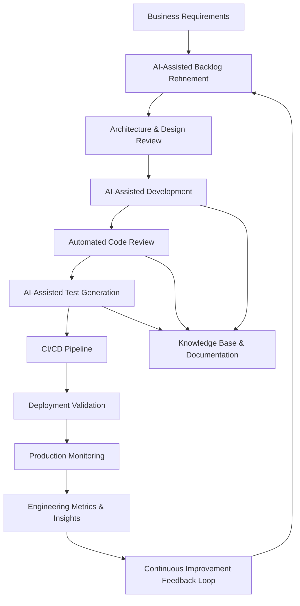

# Agentic Engineering Workflow

## Overview

This workflow demonstrates how AI capabilities can support modern software engineering delivery without replacing engineering ownership or governance.

The objective is to improve:

- engineering productivity
- delivery consistency
- release quality
- operational visibility
- team efficiency

## AI-Assisted Delivery Areas

### Backlog Refinement

AI can assist with:

- story decomposition
- requirement clarification
- acceptance criteria generation
- dependency identification

### Architecture & Design

AI tooling can support:

- documentation generation
- architecture summarisation
- design option analysis
- standards validation

### Development Support

AI-assisted engineering may include:

- code suggestions
- boilerplate generation
- refactoring support
- developer guidance

### Automated Quality Engineering

AI can help accelerate:

- unit test generation
- integration test creation
- regression analysis
- code quality checks

### Operational Monitoring

AI-assisted operational tooling may support:

- anomaly detection
- incident analysis
- trend identification
- delivery forecasting

## Governance Principles

Enterprise AI adoption should always include:

- human oversight
- security controls
- compliance validation
- IP protection
- engineering accountability
- auditability

## Engineering Leadership Perspective

Successful AI adoption requires balance between:

- automation
- governance
- developer enablement
- operational control
- measurable business value

The focus should remain on enabling engineering teams rather than replacing engineering judgement.
