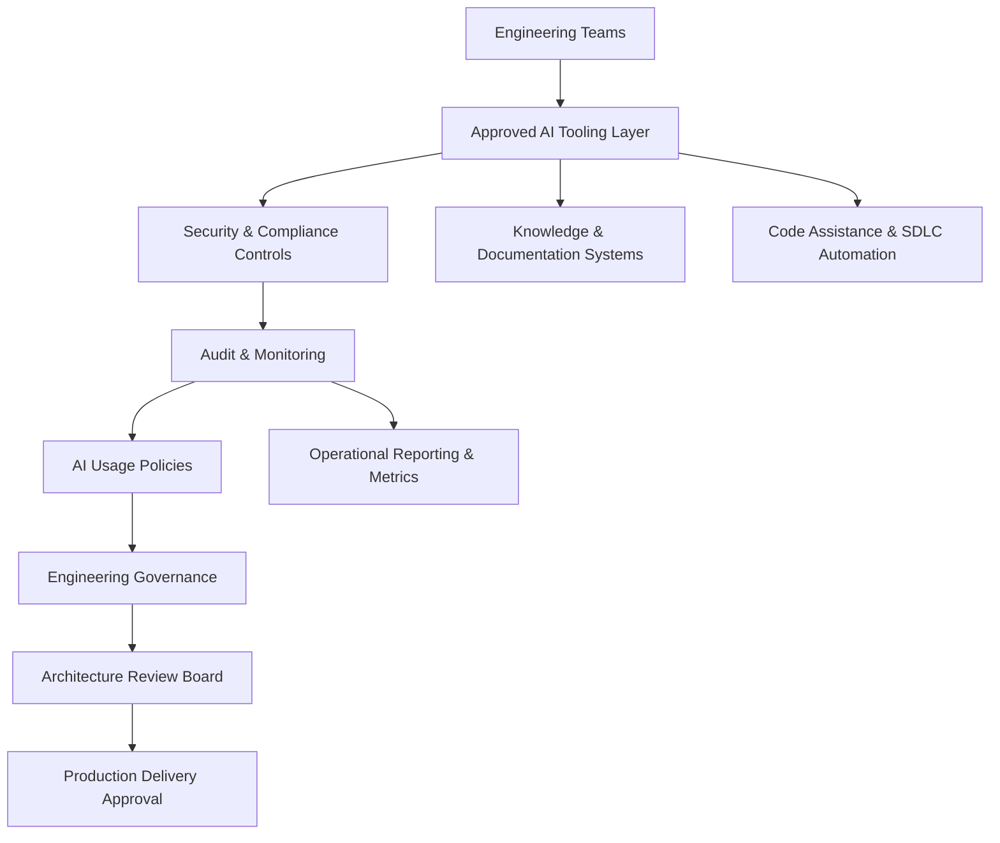

# Enterprise AI Governance Model

## Overview

Enterprise AI adoption requires governance, operational controls, and clear engineering accountability.

This model demonstrates a structured approach for integrating AI capabilities into engineering workflows while maintaining security, compliance, and delivery standards.

## Governance Objectives

- secure AI adoption
- protection of enterprise IP
- operational transparency
- engineering accountability
- compliance alignment
- measurable business value

## Approved AI Usage Areas

Examples may include:

- documentation generation
- backlog refinement support
- test generation
- code analysis
- operational insights
- delivery metrics analysis
- developer productivity support

## Key Control Areas

### Security & Compliance

AI tooling should comply with:

- enterprise security standards
- data protection requirements
- regulatory obligations
- access control policies

### Human Oversight

Engineering ownership remains mandatory for:

- architecture decisions
- production approvals
- security validation
- release governance
- code review accountability

### Monitoring & Auditability

AI usage should support:

- operational monitoring
- audit trails
- governance reviews
- usage reporting
- policy enforcement

## Engineering Leadership Considerations

Successful enterprise AI adoption requires:

- clear operating standards
- leadership sponsorship
- practical enablement
- measurable outcomes
- controlled experimentation
- continuous governance review

## Strategic Perspective

AI should enhance engineering capability, delivery quality, and operational maturity while preserving strong governance and engineering accountability.
